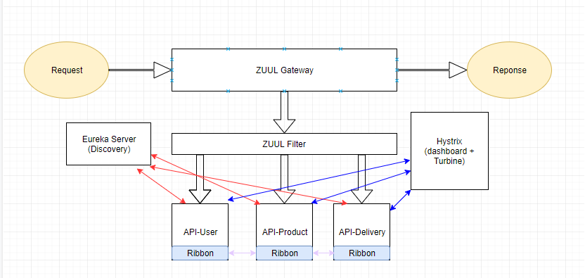

# msa-example
사내 교육 MSA


## Architecture


## 설치 및 Test URL

1. Intellij 개발툴 설치 (https://www.jetbrains.com/idea/download/#section=mac)

2. RabbitMQ 설치 (https://www.rabbitmq.com/download.html)

- 사용자 추가

```sh
rabbitmqctl add_user config config
rabbitmqctl set_user_tags config administrator
rabbitmqctl set_permissions -p / config ".*" ".*" ".*"
```

- GUI Console사용하기
```sh
rabbitmq-plugins enable rabbitmq_management
```

3.     JDK 1.8 설치

4.     개발툴 세팅

  - Preferences->Build->Compiler->Annotation Processors -> Enable annotation processing 체크
  - Preferences->Plugins Lombok Plugin 설치
  

5.     빌드 및 실행 순서

* Cloudconfig

* Service-discovery

* Api-gateway

* Hystrix-dashboard

* Api-user,api-product,api-order,api-delivery


6. WebGUI

 * Eureka : http://localhost:9000

 * Hystrix : http://localhost:8998/hystrix/monitor?stream=http://localhost:8998/turbine.stream

 * RabbitMQ : http://localhost:15672


7. API TEST

 * User API : http://localhost:8081/v1/user/{id}

 * Product API : http://localhost:8082/v1/product/{id}

 * Order API : http://localhost:8083/v1/order/{id}

 * Delivery API : http://localhost:8084/v1/delivery/{id}

 * API Gateway : http://localhost:8000/{서비스도메인}/{API Endpoint}

      *  http://localhost:8000/user/v1/user/u001

      * http://localhost:8000/product/v1/product/0001

      * http://localhost:8000/order/v1/order?userId=u0002
